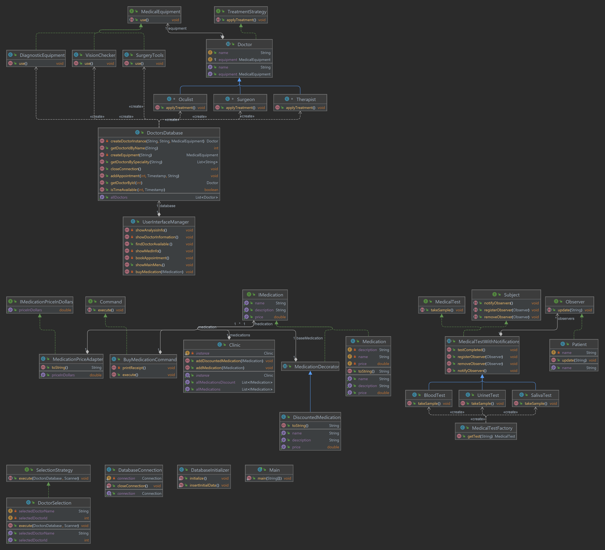

# Final project: eMed(online clinic)

Group: SE-2205

Team members: Zholaman Marshiitov

**Project Overview:**

**Information about the project:**

- This project is a Java-based console application designed to manage patient-doctor interactions within a medical facility. It utilizes several design patterns and Java features to organize a system that handles doctors' information, medical tests, appointments, and medication management.

**Idea of the project:**

- The core idea is to facilitate patients' access to medical services, such as finding information about doctors, booking appointments, searching for available doctors, obtaining medical test results, and purchasing medications. The system aims to streamline these processes using a user-friendly command-line interface.

**Purpose of the work:**

- The primary purpose of this software is to enhance the efficiency of healthcare administration by automating routine tasks, thereby reducing wait times, minimizing administrative burdens, and improving the overall patient care experience.

**Objectives of the work:**

- To create a centralized platform for managing healthcare-related activities.
- To implement a user-friendly interface for patients and administrative staff.
- To apply design patterns that support easy maintenance and future expansions of the software.

**Main body:**

**- equipment package:**

**MedicalEquipment (Interface):**

This interface declares a single method use(), which is intended to be implemented by any class that represents medical equipment. It provides a common protocol for all concrete equipment classes.

**DiagnosticEquipment (Class):**

This class implements the MedicalEquipment interface, indicating that it represents equipment used for diagnostic purposes.
The use() method is overridden to print out a message specific to diagnostics, suggesting the action that this equipment performs.

**SurgeryTools (Class):**

Another concrete implementation of the MedicalEquipment interface, this class is tailored to represent surgical tools.
Its use() method is tailored to indicate usage during surgeries, showing that it's another specialized form of medical equipment.

**VisionChecker (Class):**

This class also implements the MedicalEquipment interface, specifically representing equipment used to check a patient's vision.
The overridden use() method provides a message that aligns with the function of vision checking.

**The Design Pattern Used:**

The pattern used here is the Strategy Pattern. This pattern is characterized by defining a family of algorithms, encapsulating each one, and making them interchangeable. In this case, MedicalEquipment serves as a strategy interface for different medical equipment usage strategies. Each concrete equipment class (DiagnosticEquipment, SurgeryTools, VisionChecker) implements this interface (i.e., strategy) in its own way.

**- doctors package:**

**Doctor (Abstract Class):**

An abstract class that defines the common structure of a doctor with attributes such as name, specialty, and the medical equipment they use.
It implements the TreatmentStrategy interface, indicating that different types of doctors can have different treatment strategies.

**Oculist, Surgeon, Therapist (Concrete Classes):**

These classes extend the Doctor abstract class, each representing a different specialist.
Each class overrides the applyTreatment() method to simulate the specific treatment process related to their specialty.
The classes contain a constructor that invokes the constructor of the superclass (Doctor), passing along the necessary information.

**DoctorsDatabase (Class):**

This class acts as a data access object that interacts with a database to retrieve and manipulate data related to doctors.
It includes methods for retrieving doctors by specialty, checking appointment availability, adding appointments, and fetching individual doctor details.
It has a private method createEquipment() to instantiate MedicalEquipment objects based on a string identifier, illustrating a Factory Method pattern.

**SelectionStrategy (Interface):**

This interface defines the execute() method that any selection strategy must implement.
It's used to encapsulate the algorithm that selects a doctor.

**DoctorSelection (Class):**

Implements the SelectionStrategy interface.
It's responsible for the user interface aspect, where it interacts with the user through the command line to select a doctor based on the provided list and availability.

**TreatmentStrategy (Interface):**

This interface declares the applyTreatment() method that must be implemented by classes that will perform treatment actions.

**Design Patterns:**

1. Strategy Pattern:

The TreatmentStrategy interface and its implementation by the Doctor subclasses represent the Strategy pattern. It allows the algorithm (treatment procedure) to be selected at runtime based on the doctor's specialty.
The SelectionStrategy interface and its implementation by DoctorSelection also represent the Strategy pattern, allowing the selection algorithm to change independently from clients that use it.

2. Factory Method Pattern:

The createEquipment() method inside the DoctorsDatabase class represents the Factory Method pattern. It provides a way to create objects (in this case, MedicalEquipment) without specifying the exact class of object that will be created.

**- medication package:**

**BuyMedicationCommand class:**

Description: This class represents a command to buy medication. It encapsulates all the information needed to perform an action or trigger an event at a later time. The execute() method, when called, will print a receipt of the purchase.

**Command interface:**

Description: This is an interface for executing an operation. Classes that implement this interface are required to define the execute() method, which contains the code for executing an action.

**DiscountedMedication class:**

Description: This class extends MedicationDecorator and provides a way to add discount functionality to the medication objects without altering their structure. It modifies the getPrice() method to return the price after applying the discount.

**IMedication interface:**

Description: It defines the interface for medication objects with methods for retrieving price, description, and name. This allows for different implementations that can be swapped out without changing the context that uses them.

**IMedicationPriceInDollars interface:**

Description: This interface provides a method to get the price in dollars, which suggests that it might be used to adapt the existing medication price, which is likely in euros, to dollars.

**Medication class:**

Description: This class implements the IMedication interface and represents a basic medication object with a name, description, and price.

**MedicationDecorator abstract class:**

Description: This class is a base decorator for medications, implementing the IMedication interface. It's designed to have a baseMedication that it decorates with additional functionality.

**MedicationPriceAdapter class:**

Description: This class adapts the price of a medication from euros to dollars. It wraps an instance of IMedication and uses a conversion rate to return the price in a different currency.
Each of these classes and interfaces corresponds to a specific role within the respective design patterns:

**Pattern used:**

The Command Pattern decouples the object that invokes the operation from the one that knows how to perform it.
The Decorator Pattern adds additional responsibilities to objects dynamically and provides a flexible alternative to subclassing for extending functionality.
The Adapter Pattern allows objects with incompatible interfaces to collaborate. It wraps an interface around an existing class to make it compatible with another interface.

**- test package:**

**MedicalTest interface:**

Description: This interface defines the takeSample() method that must be implemented by different kinds of tests. It allows the tests to be interchangeable under a common interface.

**BloodTest, SalivaTest, UrineTest classes:**

Description: These classes extend MedicalTestWithNotifications and implement the takeSample() method with specific steps for each type of test. They represent different types of medical tests. The testCompleted() method in these classes triggers notifications to observers, indicating a template method pattern since it defines the skeleton of an algorithm in a method.

**MedicalTestWithNotifications abstract class:**

Description: This abstract class provides a base implementation for a medical test that can notify observers (like patients) when a test is completed. It maintains a list of observers and implements methods to add, remove, and notify them.

**Observer interface:**

Description: This interface requires an update() method that is called when a subject (like a medical test) changes state. It's the communication link to the observers when a notification is necessary.

**Patient class:**

Description: Implements the Observer interface, allowing instances to be notified of changes or events (such as the completion of a medical test). When update() is called, it prints a notification message for the patient.

**Subject interface:**

Description: This interface provides methods for attaching, detaching, and notifying observers about the completion of medical tests.

**MedicalTestFactory class:**

Description: This class provides a method getTest() to create instances of different medical tests based on a string parameter. It encapsulates the instantiation logic and returns a MedicalTest object, allowing for easy addition of new test types without modifying the consumer code.

**In summary, the system uses:**

The Observer Pattern with Subject, Observer, MedicalTestWithNotifications, and Patient to implement a subscription mechanism for notifications.
The Factory Method Pattern via MedicalTestFactory to create objects, allowing for flexibility and scalability in object creation.

**Conclusion:**

**Key points of the project:**

The project is a Java-based system for managing healthcare services.
Utilizes design patterns like Observer, Factory, Command, Singleton, Strategy, and Adapter.

**Project outcomes and Challenges faced:**

**Outcome:** A flexible and extendable system that can handle multiple healthcare administrative tasks.

**Challenges:** Ensuring the system is easy to navigate via command-line interface, implementing the design patterns correctly, and handling exceptions such as incorrect user input or parse errors.

**Future improvements:** 

**Graphical User Interface (GUI):** Transitioning from a command-line interface to a GUI for better user interaction.

**Expanded Database Integration:** Moving from a static database to a dynamic, persistent database system.

**Scalability:** Refactoring the code to allow easy integration with other systems, such as online booking platforms or electronic health records.

**Internationalization:** Implementing a language option to cater to non-Russian speaking users.